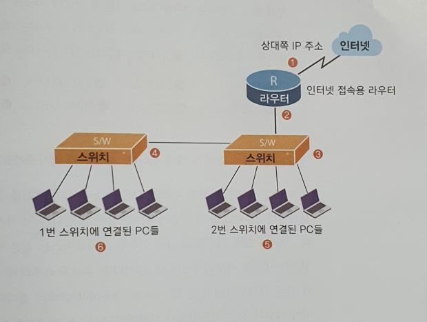

# Network-Questions
* **시리얼 인터페이스 란?**

>시리얼 인터페이스는 인터넷과 연결되는 인터페이스(허브) 이다.

* **이더넷 인터페이스 란?**

>이더넷 인터페이스는 내부 네트워크 와 연결되는 인터페이스(허브) 이다.

* **문제 4️⃣ | 네트워크에 부여된 주소가 203.240.100.0이다.이 네트워크를 가지고 2,3,4,5,6번에 IP주소를 부여했습니다. 2번의 라우터 이더넷 인터페이스 의 IP주소는 203.240.100.1입니다. 또 라우터의 시리얼 인터페이스의 IP 주소는 210.11.2.2 입니다. 3번 즉  스위치 1의 IP주소는 203.240.100.10입니다. 이때 5번 PC의 IP주소의 기본 게이트웨이 가 맞게 짝지어진 것은 무엇일까요?**


* **기본 게이트 웨이란 ?**

>*PC는 기본 게이트 웨이가 설정이 되있지 않는는다면, PC로 인터넷을 사용하지 못합니다.
기본 게이트웨이란 '기본이 되는 문' 이라고 해석이 됩니다. 즉 내부 네트워크 에서는 라우터 없이도 통신이 가능합니다. 같은 브로드캐스트 도메인 에서는 라우터 없이 통신이 가능하다. 즉 기본 게이트웨이란 내부 네트워크 에서 없는 녀석 을 찾을 때 밖으로 통해 있는 문이 되는 겁니다. 다라서 이 문 은 바로 라우터의 이더넷 인터페이스가 되는것이다.*

``` 
참고로 라우터에서는 인터페이스 별로 IP를 부여하지만 , 스위치나 허브에서는 IP주소를 장비별로 하나씩만 배정합니다.
```
``` 
또 이런 스위치나 허브에 IP를 배정하는 이유는 단지 관리를 위한 것입니다. 즉 허브에 IP주소를 배정하지 않아도  또는 잘못 배정해서 통신이 안된다는 말은 틀린것입니다.
```
```
(물론 IP주소를 겹쳐 써서 IP주소가 충돌하는 경우는 빼고 말입니다. 또 Layer 3 이상의 스위치는 물론 IP주소를 재대로 줘야겠죠?)
```
**서브넷 마스크 문제1️⃣| 공인 Ip주소를 210.100.1.0(서브넷 마스크 255.255.255.0) 네트워크를 받았습니다. 이공인 IP를 이용하여 PC가 30대 인 네트워크를 최소 4개이상 을 만든후 이들 네트워크를 라우터를 이용하여 서로 통신하게 하려고 합니다.어떻게 해야할까요?**

> 주어진 IP주소는 클래스 C입니다 즉 호스트 부분이 적어도 30이 되어야 합니다. 그러므로 210.100.1.0000 0000 의 네트워크 에서 적어도 0000 0000 이부분이 호스트 의 개수만큼 되어야 합니다.


