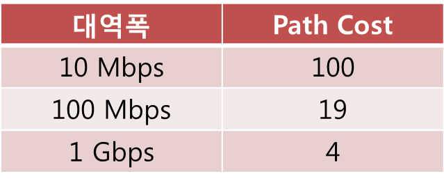

# 네트워크 복습 2

- 브리지 ID (BID)
  - 브리지나 스위치 들이 통신할 떄 서로를 확인 하기 위해 하나씩 가지고 있는 번호이다.
  - Bridge Priorty (브리지 우선순위)16bit , Mac 주소 48bit 로 구성되어있다.
    
    [Bridge Priorty(브리지 우선순위)]
  - 16bit이므로  0 ~ 2의16승 - 1 (0~65535) 디폴트 값으로 그 중간값인 32768 을 사용한다.
  - Priorty 는 낮은 값이 더 높은 우선순위임
- Path cost 
  - 브리지가 얼마나 가까이 , 더 빠른 링크로 연결되어 있는지 알아내기 위한 값
  - 한스위치 에서 다른 스위치로 가는데 드는 비용
  
    ``` 
    (물론 브리지 와 스위치는 다른 개념이지만 현재는 브리지와 호스트가 같은 개념으로 생각해도 무방함)
    ```
  - 1Gbps, 10Gbps, 2.4Gbps 등 다양한 속도가 나오면서, 소수점인 Path Cost 가 나오지 않도록 IEEE에서 Path Cost 값을 정해줌 (지금은 이 값을 사용)
  
    ex) 링크 대역폭이 10Gbps 일 경우, 
      
    Path Cost = 1000Mbps / 10Gbps
    = 1000Mbps / 10000Mbps = 0.1 -----> 소수점이라 불편 ㅠㅠ
    

- 스패닝 트리 프로토콜 
  
  규칙 
  
  1. 네트워크 당 하나의 루트 브리지를 갖음
  2. Not Root Bridge 는 무조건 하나의 루트포트를 갖음
  (루트포트 : 루트브리지 와 가장 가까운 포트 = Path Cost 가 가장 적게 드는 포트)
  3. 세그먼트 당 하나의 Desinated Port 를 갖음 
  (세그먼트 : 브리지 또는 스위치 간의 연결링크 이다.)
  - **스패닝 트리 프로토콜 에서 루트 포트나 Desinated 포트가아닌 나머지 포트들은 다 막아버려서루핑 방지.** 

- BPDU (Bridge Protocol Data Unit)
  - 브리지는 스패닝 트리 정보를 자기들끼리 주고 받기 위해 특수한 프레임을 사용하는데 , 이를 BPDU 라고 한다.
  - BPDU 에 실려있는 내용 
    1. Root BID : 루트브리지의 브리지 아이디
    2. Root Path Cost : 루트브리지까지 가는 경로 값
    3. Sender BID : 보내는 브리지의 BID
    4. Port ID : 어떤 포트에서 보냈는지 알게해줌

  - 브리지나 스위치가 부팅하면 브리지는 모든 포트로 BPDU 를 매 2초 마다 보내면서 서로 스패닝 트리정보를 주고받음
  - BPDU 를 서로 주고 받으며 누가 루트브리지, 루트포트, Desinated Port 가 될건지 결정함.
  
  * **루트브리지 정하기**
    - 무조건 낮은 BID 를 갖는 브리지가 루트브리지임
    
    1. 스위치 B, 스위치 C, 가 부팅됨
    브리지가 맨 처음 부팅하고 나서 내보내는 BPDU 에는 Sender BID 의 정보 + 자기 자신의 BID 를 넣음 루트브리지의 BIUD 에는 자신의 BID 를 넣음
    이제 막 부팅 해서 BPDU 를 한번도 못받았기 때문에 혼자 네트워크 에 있다고 생각
    2. 스위치 B 의 상황.
    스위치 C의 BPDU 를 받아서 루트 브리지 BID 를 보니 32768.3임
    내가 알고 있는 32768.2 보다 크네?

         ->스위치 C 의 BPDU 를 받아서 루트 브리지 BID 를 보니 32768.3암
    
         

      1. 스위치 C의 상황
   
         스위치 C의 BPDU 를 받아서 루트 브리지 BID 를 보니 32768.3임

         내가 알고있는 32768.2 보다 낮네?
          
         ->스위치 C에서 받은 BPDU 를 무시함

      4. 스위치 A가 부팅 됨 

          스위치 A는 루트브리지 BID 로 자신의 BID 로 자신의 BID 인 32768.1을 BPDU 에 실어보냄

         스위치 B와 C로 부터 오는 BPDU 에는 루트브리지 BID 32768.2로 옴

         네가 알고 있는 32768.1 보다 크네?

         ->스위치 B와 C에는 받는 BPDU 를 무시함

         -->즉,루트브리지는 스위치 A가 됨

      [스위치 C를 루트브리지 로 하고 싶다면]
      
      -루트우선순위를 낮은걸로 바꾸면됨

      -스위치 A와 스위치 B의 브릿지 우선순위는 디폴트인 32768이므로 , 스위치 C는 이보다 작은 값으로 변경하면됨

