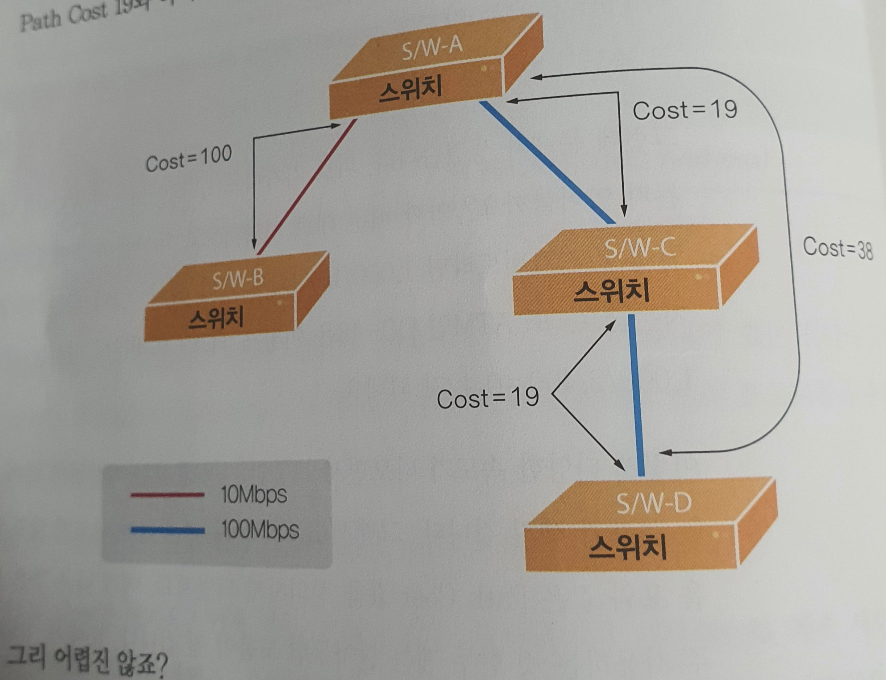

# Spaning Tree Protocol Basis 1

>스패닝 트리 프로토콜 (STP) 이란 ?

스위치나 브리지 에서 발생하는 루핑(119.p)을 막아주기 위한 프로토콜 이다.

<hr/>
스위치나 브리지 구성에서 출발지 부터 목적지까지의 경로가 2가지 이상 존재 할때 1개의 경로만을 남겨놓고 나머지는 모두 끊었다가, 사용 하던 경로에 문제발생 하면 그떄 경로를 하나씩 되살린다.
<hr/>

>STP 의 동작원리
STP를 이해하기전 알아야할 2가지 개념
- 브리지 ID

>>브리지 ID 란? 

브리지 나 스위치 들이 통신할때 서로를 확인 하기위해서 가지고 있는 번호.

>>브리지 ID 의 구조

|-(Bridge Priorty)-|-(Mac Address)-)

(-------16bit------|-----32bit-----)
>>브리지 ID 의 생성

앞에 있는 브리지 우선순위(Bridge priorty)는 16bit 이기 때문에 총 올수 있는 수는 0~65535 까지 사용할수 있습니다. (약 2¹⁶-1 개) 그중 **Bridge Priorty 의 default 값은 Bridge piorty 의 중간값인 32768 입니다.**

Bridge Priorty 뒤에 오는 Mac address 는 스위치에 고정된 값이다. 띠리사 고유 맥 어드레스가 뒤에 붙게 된다.
 
- Path Cost

>>Path Cost란 ?

Path Costs 를 직역 하자면 "길을 가는데 드는 비용" 입니다. 네트워크 분야에서 길이란 장비와 장비가 연결되어 있는 링크를 뜻합니다. 즉 브리지가 얼마나 가까이 , 그리고 얼마나 빠르게 링크로 연결되어 있는지 를 알아내기 위한 값입니다.

``` 
원래 STP를 정의 하고 있는 IEEE 802.ID에선 이 cost 값을 계산할때 1,000Mbps를 두 장비 사이 링크 대역폭으로 나눈 값을 사용했습니다.
```

>>Example Path Cost

두 스위치가 10Mbps로 연결 되었다고 가정 한다.그럼 Path Cost는 1000Mbps 를 둘사이 링크 대역폭 으로 나눈값이라고 했으니 

**1,000 / 10 = 100**

이므로 따라서 Path Cost 는 100이 됩니다.

즉 Path Cost 는 링크의 속도 (대역폭) 이 빠르면 빠를수록 좋다 

>>Path Cost 계산



사진 처럼 S/W A 에서 S/W C 의 cost 는 19 입니다.
S/W C 에서 S/W D 의 cost 는 19 입니다.

그러므로 S/W A 에서 S/W D 의 cost 는 38 이 됩니다.


- review
  
  스패닝 트리를 위해 알아야 할 개념 2가지 
    
    - bridge ID
      이 ID 는 스패닝 트리 계산에 유용하게  
    - Path cost
