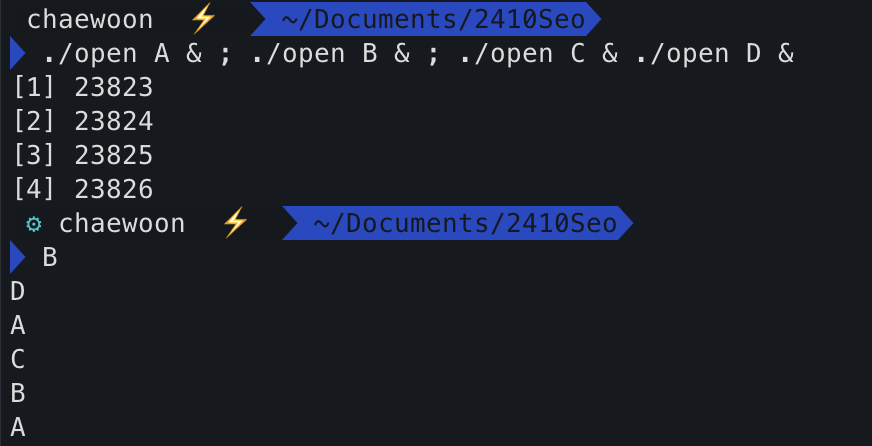

# OS
## What is OS?
- 자원 관리자(resource manager) 이라고 할수 있다.
- 물리적인 자원(CPU,DRAM,Disk,Flash,Network) 를 가상화 시켜서 더 효율적으로 자원을 관리 할수 있도록 해주는 시스템을 말한다.
- >운영 체제와 커널의 용어 에대해서 헷갈린다. 커널은 항상 메모리에 상주?(to be there all the time) 해서 자원을 관리하는것을 의미하고 , 운영체제는 항상 메모리에 상주하지는 않는다. Linux 환경에서는 OS 가 항상 메모리에 상주하기 때문에 Linux 에서는 운영체제와 커널이 같다고 생각하면 된다.

## What is the role of OS
- **프로그램 을 실행하기 쉽게 만들어준다.**
- **시스템을 올바르고 효율적이게 작동하도록 관리해준다.**

## 운영체제의 추상화

  **운영체제의 추상화는 물리적인 자원 들을 강력하고 사용하기 쉽게 만들어준다.**

  예를 들면 가상메모리를 사용해서 실제 메모리가 감당할수 있는 양보다 더많은 크기의 프로그램을 메모리에 올릴수 있게 해주거나, 멀티테스킹 , 동시성 기법을 사용해서 많은 프로세스 들이 동시에 CPU 를 사용할수 있도록 해주는 역할 등이 있다.

  이 추상화된 운영체제의 기능들을 , 운영체제에서는 **시스템 콜(System Call API)** 을 제공해 사용자가 쉽게 사용할수 있도록 도와준다.

  ### System Call (이해가 안되노)

운영체제에는 유저모드 ,커널모드 두가지 모드가 존재하는데 유저모드에서 시스템콜이 호출이 되면 콜인터페이스를 통해 커널 모드로 전환이된다. 이를 **모드 스위치(mode switch)** 라 하고, 운영체제는 커널모드에서 시스템 콜을 실행 시킨뒤 다시 유저 모드로 돌아가게 한다.

각 분야별 시스템 콜 예시는 다음과 같다.
  - 프로세스 제어 : fork() , exit() , wait()
  - 파일 관리 : open() , read() , write() , close()
  - 장치 관리 : ioctl() , read() ,write() 
  - 정보 유지 : getpid() , alarm() , sleep()
  - 보안(Protection) : chmod() , umask() , chown()


## CPU 가상화(Virtualizeing CPU )
``` c
// cpu.c 파일
#include <stdio.h>
#include <stdlib.h>
#include <sys/time.h>
#include <assert.h>
#include <unistd.h>

int main(int argc, char *argv[])
{
    if (argc != 2) {
        fprintf(stderr, "usage: cpu <string>\n"); exit(1);
    }
    char *str = argv[1];
    while (1) {
        sleep(1);
        printf("%s\n", str);
    }
    return 0;
}
```

위와 같은 프로그램 을 CPU 가 하나인 환경에서 쉘로 실행시 , 결과는 다음과 같다.




> *& 는 프로그램을 backgroud 에서 돌린다는 뜻*

실제로 cpu 가 1개임에도 불구하고, 마치 여러개의 프로그램이 동시에 돌아가고 있는듯한 착각을 불러일으킨다. 이를 **CPU 가상화** 라고 함

## 메모리 가상화(Virtualizing Memory)

서로다른 프로그램 두 개를 동시에 실행한 후 프로세스 id 의 주소를 출력해보면 주소가 똑같이 출력되는 경우가 있다. 이는 메모리 가상화를 이용했기 때문인데 , 실제 물리적 메모리 주소는 다르지만 가상화 된 메모리 주소는 같을수 있기 때문에 이렇게 출력되는 것이다.
```
메모리와 관련된 용어 정리 
- TLB (Translation Lookaside Buffer ) : 가상메모리 주소를 물리적인 메모리 주소로 변환 할때 사용되는 캐시
- page , segmentation : 메모리 가상화를 구현하는 방법 
- NUMA (Non-Uniform memory Access) : 멀티 프로세서 시스템에서 사용되는 메모리 설계 방법중 하나
```
## 동시성 문제(Concurrency)
- 같은 프로그램이나 시스템에서 동시에 뭔가를 하려 했을때 생기는 문제들을 말한다.
- 예를 들어 서로 다른 두 개의 스레드가 같은 자원을 동시에 접근하려 했을때(이를 **race condition** 이라한다) , 하나의 스레드만 접근이 되는경우가 있다. 이를 **원자성(atomicity)** 라고 하는데, 이 원자성을 유지하기 위해 lock 이 사용된다. 
  > *lock : 자원을 접근하기 전에 lock 를 걸어놓고, 끝나면 unlcok 을 수행한다.*

## 지속성 (Persistence)
  유저는 데이터를 영구적으로 유지하길 우너한다. DRAM 은 휘발성 이므로 , 저장소(DISK,SSD 같은) 에 데이터를 작성해 영구적으로 데이터를 유지하는것을 **지속성(Persistence)** 라고 한다.

  ###  운영체제 설계 목표
  - 추상화(Abstraction) : logic gate 의 이해없이 프로그램을 만들 수 있도록 해주는 것
  - 수행능력(Performance) : OS 의 오버헤드를 최소화 시키는것
  - 보안(Protection) : 다른 프로세스가 또 다른 프로세스 로 부터 독립되어있어야 한다.
  - 신뢰성(Reliablity)
  - etc ...(Policy , Mechanism 의 분리)
  ```
  1. policy : 다음에 프로세스 수행을 어떻게 할거냐 ? 같은것들 , 무엇을 수행할것인가.
  2. mechanism : queue 를 사용할것이다. , stack 을 사용할것이다 같은것들 , 어떻게 수행할것인가.
  ```
