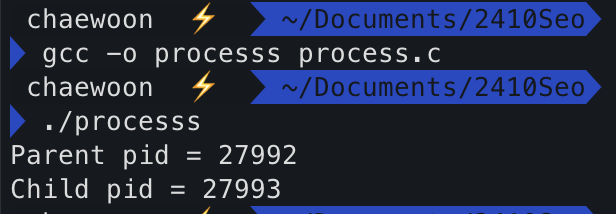

# Process
## What is Process 
실행중인 프로그램.
## Process 의 구조
다음과 같이 실행을 위한 자원들이 필요하다.
  - CPU : PC , SP 같은 레지스터들
  - Memory(주소 공간)의 영역들 , 낮은주소 -> 높은주소 순으로 작성
    - text 영역 : 프로그램 코드들
    - Data 영역 : 전역 변수들
    - Heap 영역 : 동적할당 된 것들.
    - Stack 영역 : 지역변수 , 매개변수 등...
  - I/O 정보 : 장치를 포함한 open 된 파일들
## Process API
프로그램은 어떻게 실행되는가 
  1. Load 합니다. : 주소공간에 코드와 static data 를 넣는다.
  2. 동적 할당 합니다 . : stack , 파라미터 초기화 , 필요하면 Heap을 사용합니다.
  3. 초기화
  4. entry point 점프
## Process 의 Status & "Justice"

  
  - `new` 상태 : 프로세스가 이제 막 만들어진 상태 , 메모리에 올라가기 전의 상태이다.
  - `ready` 상태 : 프로세스가 메모리로 올라간 상태. CPU 에 올라가기 전 상태이다.
  - `running` 상태 : `ready` 상태에서 **dispatch(스케줄 이라고도 한다)** 가 되어 CPU 를 할당받아 실제 수행되고 있는 상태를 말한다. 그런데 프로세스 하나가 CPU 를 독점하는것을 방지하기 위해 timeout을 시켜 강제로 다시 `ready` 로 돌아가게 할수도 있다. 아를 **선점(preemptive)** 한다라고 한다.
  - `waiting` 상태 : I/O 또는 이벤트로 인해 잠시 대기 상태로 전환된 상태이다. 이벤트가 종료되면, 프로세스는 다시 `ready` 상태로 돌아간다.
  - `terminated` 상태 : `running` 상태인 프로그램이 종료되면 `terminated` 상태가 된다.
  - `suspend` 상태 : `ready` 상태 나  `waiting` 상태인 프로세스를 메모리에서 내리는 것이다. `running` 상태에선 suspend 시킬수 없고 ,`waiting` 상태가 suspend 되면 `suspend-wait` 상태라 한다.
  - resume : `suspend` 상태에서 다시 메모리로 올라가는것을 `resume` 이라 한다.

## PCB(Process Control Blcok)
  - 프로세스를 관리하기 위해서 하나의 자료구조가 만들어지고 거기에 **프로세스의 정보가 담겨있는 것** 이 생기는데 이를 PCB 라고 함.
  - 프로세스의 상태 , pid,PC(Program Counter),CPU 스케줄링 정보등을 가지고 있음.
## Process 관련 system call 
  - **fork()** : 새로운 프로세스를 생성. 생성된 프로세스의 ID(PID) 를 반환한다. 부모 프로세스가 먼저 호출 될 시 , 자식프로세스가 먼저 실행될 지 알수 없다. 즉 *Non-deterministic* 하다.
  - **wait()** : 자식 프로세스가 끝날 때 까지 wait 를 호출한 이후의 작업을 실행시키지 않는 system call. 즉 fork 함수를 *deterministic* 하게 바꿔준다. 죽은 자식 프로세스 pid 를 반환한다.

      예를 들어보자 . 아래와 같은 코드가 있다.
      ```C
      // C program to demonstrate working of wait()
      #include<stdio.h>
      #include<stdlib.h>
      #include<sys/wait.h>
      #include<unistd.h>

      int main()
      {
        pid_t cpid;
        if (fork()== 0)
          exit(0);		 
        else
          cpid = wait(NULL);
        printf("Parent pid = %d\n", getpid());
        printf("Child pid = %d\n", cpid);

        return 0;
      }
      ```
      이코드는 무조건 아래와 같은 순서로 결과가 나오게 된다.(pid 값은 변경될 수 았음.)
       
  - exec() : 코드와 static data를 Load 및 덮어쓰기 를 하고, stack 과 heap 을 초기화 하고 실행합니다. 사용자가 원하는 프로그램을 실행시킬 수 있습니다.
  - exec 과 fork 를 분리한 이유 : 자식 프로세스 가 끝나기 전 무언가를 하고 싶을 수 있기 때문에 
  - getpid() : pid 를 획득
