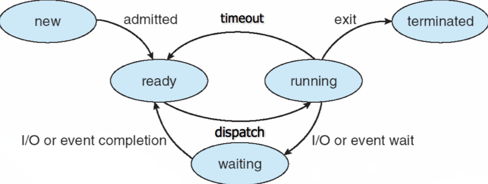

# Process
## What is Process 
실행중인 프로그램.
## Process 의 구조
다음과 같이 실행을 위한 자원들이 필요하다.
  - CPU : PC , SP 같은 레지스터들
  - Memory(주소 공간)의 영역들 , 낮은주소 -> 높은주소 순으로 작성
    - text 영역 : 프로그램 코드들
    - Data 영역 : 전역 변수들
    - Heap 영역 : 동적할당 된 것들.
    - Stack 영역 : 지역변수 , 매개변수 등...
  - I/O 정보 : 장치를 포함한 open 된 파일들
## Process 의 Status & "Justice"

  
  - new 상태 : 프로세스가 이제 막 만들어진 상태 , 메모리에 올라가기 전의 상태이다.
  - ready 상태 : 프로세스가 메모리로 올라간 상태. CPU 에 올라가기 전 상태이다.
  - running 상태 : `ready` 상태에서 dispatch(스케줄 이라고도 한다) 가 되어 CPU 를 할당받아 실제 수행되고 있는 상태를 말한다. 그런데 프로세스 하나가 CPU 를 독점하는것을 방지하기 위해 timeout을 시켜 강제로 다시 `ready` 로 돌아가게 할수도 있다.