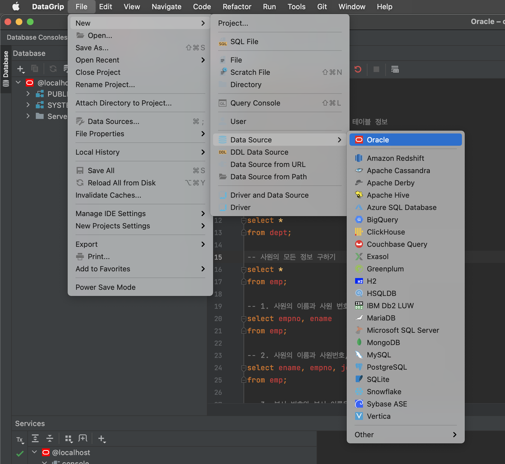
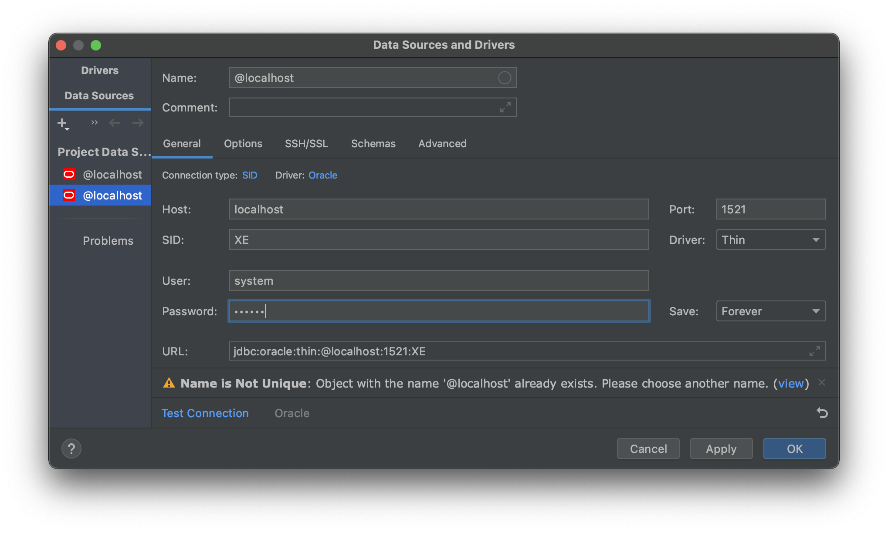

### 크롬에서 도커,DataGrip 설치
- 설치후 터미널 가서 명령어 입력
```
docker search oracle-xe-11g
docker pull jaspeen/oracle-xe-11g
docker images
docker run --name oracle11g-test -d -p 8080:8080 -p 1521:1521 jaspeen/oracle-xe-11g
docker exec -it oracle11g-test sqlplus
```
- Data Grip 실행

> 데이터 그립 실행후 


오라클 사용

사용자 아이디 : system

비밀번호 : oracle

- 마지막으로 쿼리문 실행하면 oracleDriver 없다고 뜨니 데이터그립에서 설치해준다.(알람이 뜬다 쿼리 창 아래)