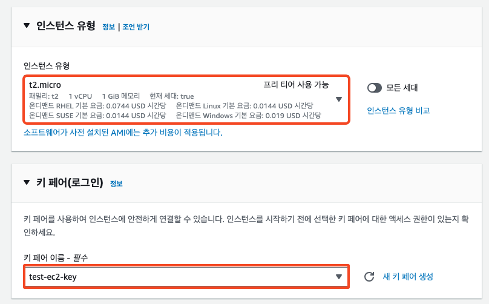

# 3. Configure static web hosting

S3 버킷에서 정적 웹 호스팅 설정 및 버킷 정책을 통해 S3 버킷에 저장되어있는 객체를 웹페이지로 호스팅 할 수 있습니다.


1. 생성한 버킷 페이지에서 \[속성(Properties)]을 선택합니다.
2. 페이지 가장 하단의 정적 웹 사이트 호스팅(Static website hosting)에서 편집(Edit)을 선택합니다.

<figure><figcaption></figcaption></figure>

3. 정적 웹사이트 호스팅 에서 "활성화"를 선택합니다.
4. 호스팅 유형에서 "정적 웹 사이트 호스팅"을 선택합니다.
5. 인덱스 문서(Index document)에 인덱스 문서 이름을 입력합니다. 인덱스 문서 이름은 대소문자를 구분하며 S3 버킷에 업로드하려는 HTML 인덱스 문서의 파일 이름과 정확히 일치해야 합니다. \
   해당 실습에서는 "index.html"로 지정하겠습니다.
6. 가장 하단의 변경 사항 저장(Save changes)을 클릭 합니다.

<figure><figcaption></figcaption></figure>

설정 이 완료되면 아래와 같이 확인 됩니다.

<figure><figcaption></figcaption></figure>

7.  정적 웹페이지로써 모든 사용자에게 공개하기 위해선, 버킷 설정시 구성하였던 퍼블릭 액세스 차단 설정을 모두 비활성화 해야하며, 버킷 콘텐츠를 공개적으로 사용 가능하도록 설정하는 버킷 정책을 추가해야 합니다.\
    \


    \[권한 (Permissions)] 탭에서 퍼블릭 액세스 차단(버킷 설정)(Block public access (bucket settings)) 이 모두 비활성화 되어있는지 확인합니다.

<figure><figcaption></figcaption></figure>

8.  버킷 콘텐츠를 공개적으로 사용 가능하도록 설정하는 버킷 정책을 추가합니다.

    아래 JSON 코드를 복사한 후 \[권한 (Permissions)] 탭 아래 버킷 정책(Bucket Policy)에서 편집(Edit)을 선택하여 버킷 정책 편집기에 붙혀넣습니다.\


    `Bucket-Name`은 버킷 이름의 자리 표시자입니다. 자체 버킷에 이 버킷 정책을 사용하려면 자체 버킷 이름과 일치하도록 이 이름을 업데이트해야 합니다.\
    \
    변경 사항 저장(Save changes)을 클릭 합니다.

```json
{
    "Version": "2012-10-17",
    "Statement": [
        {
            "Sid": "PublicReadGetObject",
            "Effect": "Allow",
            "Principal": "*",
            "Action": [
                "s3:GetObject"
            ],
            "Resource": [
                "arn:aws:s3:::Bucket-Name/*"
            ]
        }
    ]
}
```

<figure><figcaption></figcaption></figure>

<figure><figcaption></figcaption></figure>

9. &#x20;\[객체(Objects)] 탭에 있는 "index.html" 을 선택 한 후 "URL 복사" 를 클릭한 후 브라우저를 통해 접속 하여 정상적으로 아래와 같은 페이지가 확인 되어야 합니다.\


<figure><figcaption></figcaption></figure>

<figure><figcaption></figcaption></figure>
