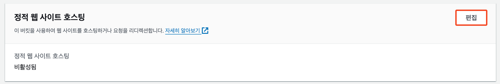

# 5. Enable Versioning

S3 버저닝을 활성화 하게 될 경우, 각 객체의 대한 새로운 버전을 할당할 경우 새로운 객체와 기존 객체들을 모두 관리할 수 있으며,  기존 객체를 복구 할 수 있습니다.

1. S3 버킷 페이지로 접근 하신 후 속성\[Config] - 버킷 버전 관리(Bucket Versioning)에서 "편집"을 선택합니다.
2. 사용 설정를 선택한 다음 변경 사항 저장을 선택합니다.

<figure><figcaption></figcaption></figure>

<figure><figcaption></figcaption></figure>

3. 다운로드 받았던, "dino.png" 이름을 기존 이미지와 동일하게 "image.png"로 지정한 후 S3 버킷에 업로드 합니다.
4. 브라우저를 통해 정적 페이지에 접근하여 정상적으로 이미지가 변경되었는지 확인 합니다.
5. S3 객체 탭에 접근하신 후 접두사 검색창 오른쪽 버전 표시 토글을 활성화 하실 경우 각 객체의 대한 버전을 확인 할 수 있습니다.\
   \
   기존 image.png 객체를 확인 해볼 경우 버저닝을 활성화 하기 전 객체의 경우 버전 ID는 Null 로 확인되며, 새로운 버전의 객체의 경우 숫자와 문자열로 이루어진 객체 ID 가 확인 됩니다.

<figure><figcaption></figcaption></figure>

6. 현재 객체의 버전이 아닌 이전 객체의 버전으로 복구 하고 싶으실 경우, 현재 버전의 객체를 삭제 해주시면, 자동으로 이전 객체의 버전으로 변경됩니다. 이를 통해 이전 버전으로 쉽게 복구 하실 수 있습니다.\
   \
   복구하신 후 이전처럼 웹페이지에서 AWS 로고를 출력하고 있는 지 확인합니다.
