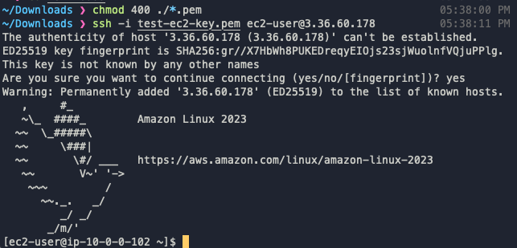

# Instance Connection Test (.pem)

EC2 인스턴스 콘솔에서 연결하려는 인스턴스를 선택한 후 **연결** 버튼을 클릭합니다.

<figure><figcaption></figcaption></figure>

인스턴스에 연결 페이지에서 SSH 클라이언트를 선택합니다.&#x20;

<figure><figcaption></figcaption></figure>

아래 나열된 지침 중 빨간 네모 안 명령을 복사하여 키가 있는 위치로 이동하여 해당 명령을 입력 합니다.

```
chmod 400 "key pair name"
```

아래 빨간 네모 안 명령을 복사하여 SSH 클라이언트를 실행 합니다.

```
ssh -i "key pair name" ec2-user@"public ip address"
```

질문 창이 뜬다면, yes 명령을 입력하여 진행 합니다.

<figure><figcaption><p>예시</p></figcaption></figure>
