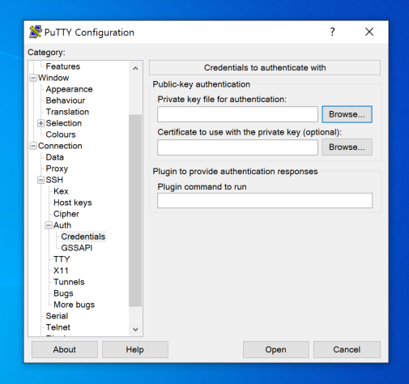

# Instance Connection Test (.ppk)

Putty 소프트웨어를 다운로드 받으신 후 해당 소프트웨어를 실행시켜줍니다.

아래 이미지와 같이 Host Name 칸에는 인스턴스의 퍼블릭 IP 주소를 넣어주시며, 포트는 22번 포트를 열어주도록 하겠습니다.

<figure><figcaption>
Putty 소프트웨어
</figcaption></figure>

이후 좌측 카테고리중 연결 - SSH - 인증 - Credential 로 들어가서 찾기 버튼을 클릭한 후  다운로드 받았던 키페어를 등록합니다.&#x20;

<figure><figcaption></figcaption></figure>

이후 아래 open 버튼을 클릭하여 인스턴스 SSH 세션에 접속 할 수 있습니다.
